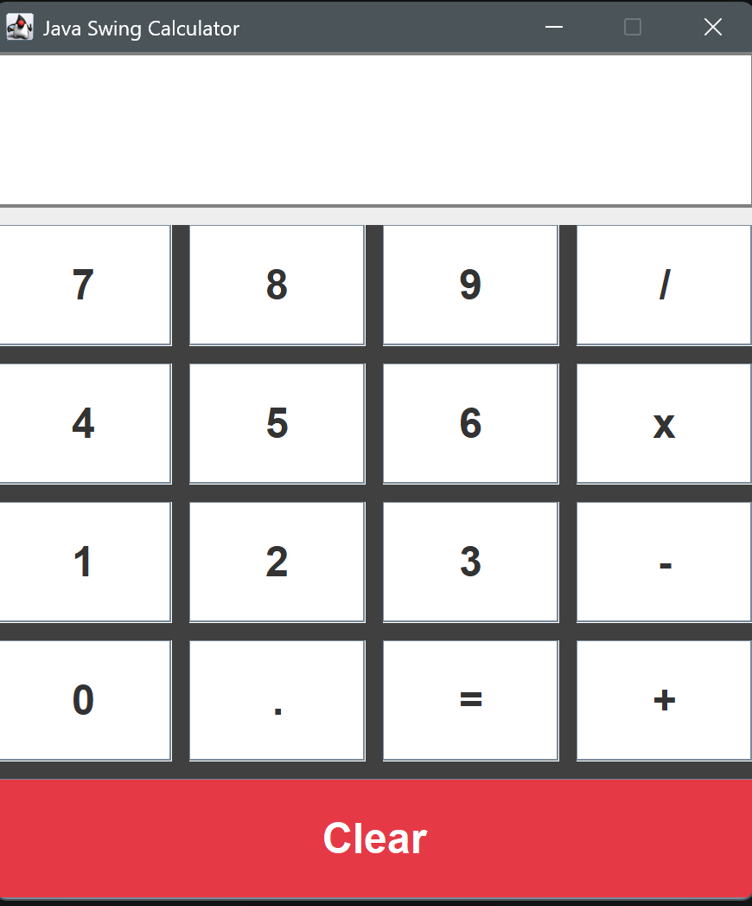
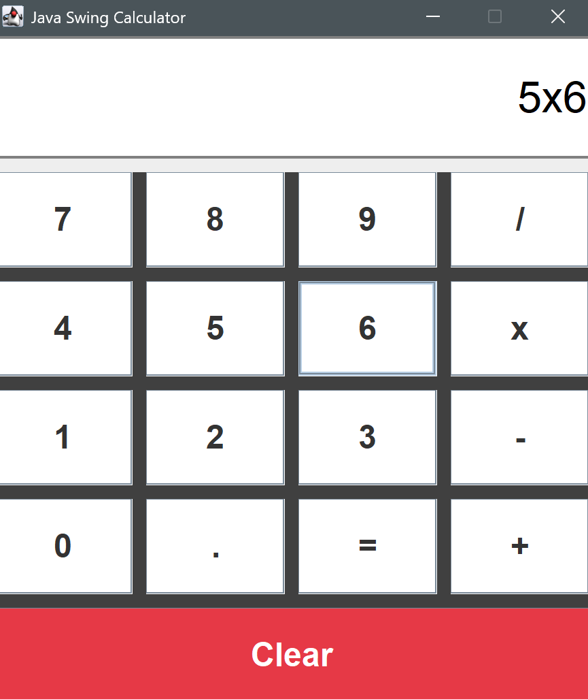
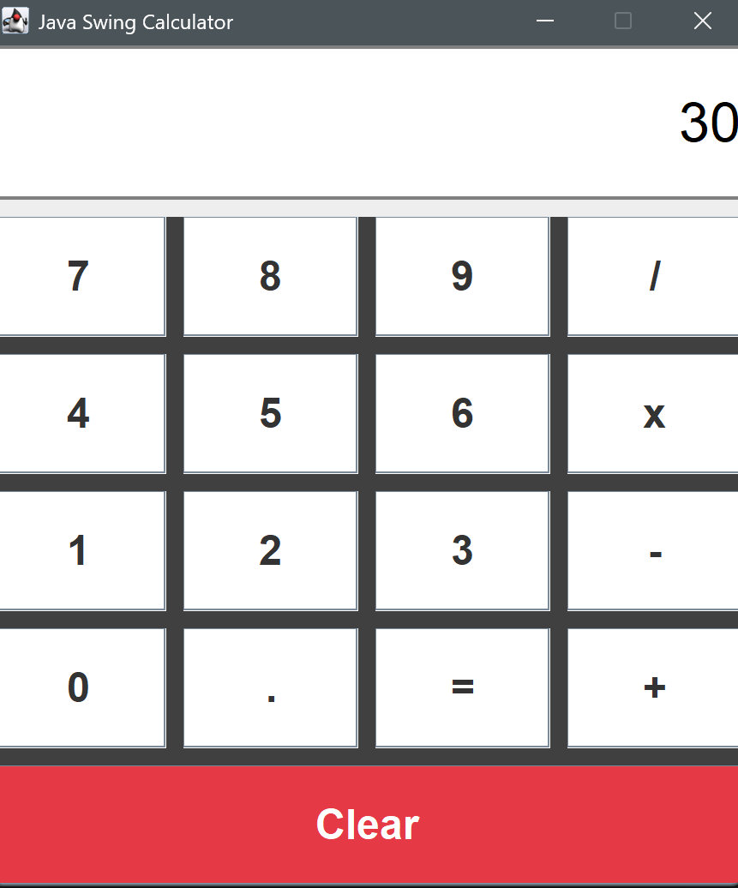

# 🧮 Java Swing Calculator

> A clean, production-ready calculator application demonstrating **professional software architecture**, **separation of concerns**, and **test-driven development**. Built with Java 11 and Swing, optimized for both functionality and code quality.

---

## 📋 Project Overview

This project showcases a fully functional desktop calculator with a polished GUI and robust backend logic. Designed as a **campus placement portfolio project** and **interview preparation tool**, it demonstrates proficiency in:

- **Object-Oriented Design** – Clean separation between UI and business logic
- **Test Coverage** – Comprehensive unit tests with JUnit 4
- **Build Automation** – Maven-based project structure
- **Error Handling** – Graceful exception handling and input validation
- **Expression Parsing** – Operator precedence and complex expression evaluation

---

## ✨ Features

| Feature | Details |
|---------|---------|
| **Basic Arithmetic** | Addition, subtraction, multiplication, division |
| **Decimal Support** | Full decimal calculation support with proper formatting |
| **Operator Precedence** | Correct evaluation order (multiplication/division before addition/subtraction) |
| **Live Display** | Real-time expression display as you build calculations |
| **Error Handling** | Graceful error messages for invalid input |
| **Clear Function** | Reset calculator state with a single click |
| **Consecutive Calculations** | Chain multiple operations seamlessly |

---

## 🛠️ Technologies & Stack

| Component | Version | Purpose |
|-----------|---------|---------|
| **Java** | 11+ | Core language (LTS release) |
| **Swing** | Built-in | Cross-platform GUI framework |
| **Maven** | 3.6+ | Dependency management & build automation |
| **JUnit** | 4.13.2 | Unit testing framework |

---

## 🎨 Architecture

The project follows **Model-View-Controller (MVC)** principles:

- **`CalculatorFrame.java`** – Presentation layer (Swing UI, button listeners)
- **`CalculatorEngine.java`** – Business logic layer (expression parsing, evaluation)
- **`CalculatorApp.java`** – Entry point (thread-safe application launcher)

This separation ensures:
- UI updates don't affect calculation logic
- Business logic can be tested independently
- Code is maintainable and extensible

---

## 📸 Screenshots





See the [`screenshots/`](screenshots/) folder for more details.

---

## 🚀 Quick Start

### Prerequisites
- **Java 11+** (OpenJDK or Adoptium)
- **Maven 3.6+**

### Build & Run

```bash
# Clone the repository
git clone <repository-url>
cd Calculator

# Compile the project
mvn clean compile

# Run the application
mvn exec:java

# Run unit tests
mvn test

# Build a JAR (optional)
mvn clean package
```

---

## 📂 Project Structure

```
Calculator/
├── src/
│   ├── main/java/com/calculator/
│   │   ├── CalculatorApp.java        # Entry point with thread-safe launcher
│   │   ├── CalculatorFrame.java      # Swing UI layer & event handling
│   │   └── CalculatorEngine.java     # Business logic & expression parser
│   └── test/java/com/calculator/
│       └── CalculatorEngineTest.java # JUnit tests for engine
├── pom.xml                            # Maven build configuration
├── README.md                          # This file
└── screenshots/                       # UI screenshots for documentation
```

---

## 🧪 Testing

The project includes comprehensive unit tests for the calculation engine:

```bash
mvn test
```

**Test Coverage:**
- ✅ Digit and operator appending
- ✅ Consecutive operator replacement
- ✅ Basic arithmetic operations
- ✅ Operator precedence (× ÷ before + −)
- ✅ Decimal value handling
- ✅ Expression clearing and error states

---

## 💡 Key Design Decisions

### 1. **Separation of Concerns**
- UI logic in `CalculatorFrame` handles only display and events
- Engine logic in `CalculatorEngine` handles all calculations
- Clean interfaces enable independent testing and modification

### 2. **Operator Precedence**
- Uses a two-pass tokenization algorithm:
  - First pass: Handle multiplication/division
  - Second pass: Handle addition/subtraction
- Ensures correct results (e.g., `2 + 3 × 4 = 14`, not `20`)

### 3. **Error Handling**
- Invalid input is silently ignored (e.g., starting with an operator)
- Incomplete expressions are sanitized before evaluation
- UI catches exceptions and displays "Error" message

### 4. **Decimal Support**
- Automatically adds leading zero before decimal (e.g., `.5` → `0.5`)
- Prevents multiple decimals in a single number
- Formats output to remove trailing `.0`

---

## 🔮 Future Enhancements

- 🎹 **Keyboard Input Support** – Use number pad and operators directly
- 📜 **Calculation History** – View and re-use previous calculations
- 💾 **Memory Functions** – M+, M−, MR, MC operations
- 📊 **Advanced Operations** – Parentheses, percentages, square root, power
- 🎨 **Theme Toggle** – Dark mode / light mode support
- ⏱️ **Keyboard Shortcuts** – Alt+C for clear, Enter for equals
- 📱 **Responsive UI** – Dynamic scaling for different screen sizes


## 📝 Code Example

```java
// Using the CalculatorEngine directly
CalculatorEngine engine = new CalculatorEngine();
engine.append("2");
engine.append("+");
engine.append("3");
engine.append("x");
engine.append("4");
engine.evaluate();
System.out.println(engine.getDisplayText()); // Output: 14
```

---

## 🤝 Contributing

This is a portfolio project. If you'd like to fork it for learning:
1. Fork the repository
2. Create a feature branch (`git checkout -b feature/your-feature`)
3. Commit your changes (`git commit -m 'Add feature'`)
4. Push to the branch (`git push origin feature/your-feature`)
5. Open a Pull Request

---

## 📄 License

This project is open source and available under the [MIT License](LICENSE).

---

## 👤 Author

Built as a demonstration of clean coding practices and software architecture principles.]

---

## ⭐ If you found this helpful, please consider starring the repository!
